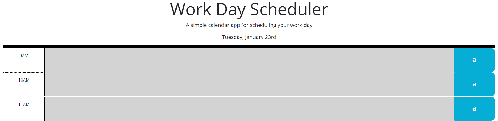
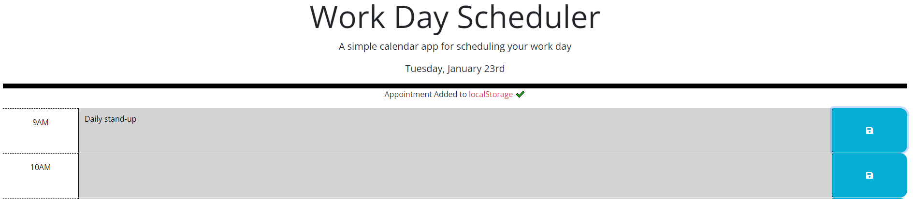
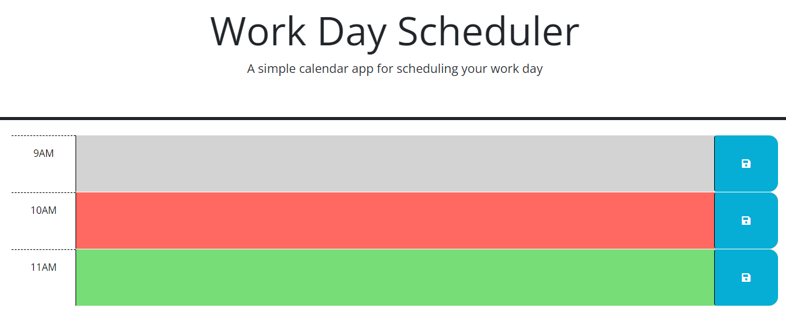
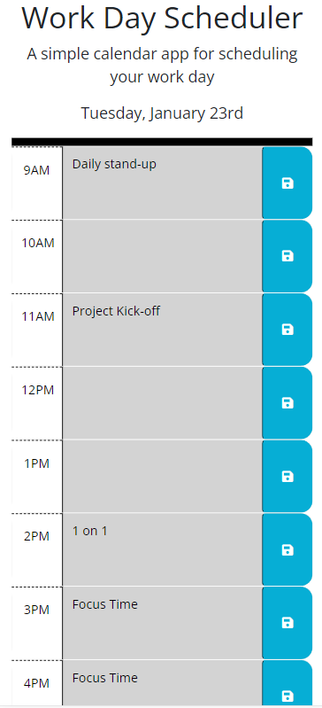

# Work Day Scheduler

## The goal of this project was to create a daily planner in which a user can save important events.  The planner will dynamically display the current date at the top, allow appointments to be saved, and indentify what hours are past, present, and future.

I learned the following:
- Further uses of the jQuery library for DOM traversal and event handling.
- More efficient and succinct uses of functions and iterations to complete tasks with less lines of code.
- How to decipher stylings provided by bootstrap and how to adjust them as needed.
- The uses and convenience of the Day.js library for date and time manipulation.

Takeaways:
- In order to match the layout of the mockup, I found that I needed to adjust some of the bootstrap classes for elements and alter the stylesheet somewhat.  
- In the provided mock up, the date of the month features an ordinal.  In my research this could not be done without adding the Day.js library to the project (not using the browser solely).  I am not familiar with that process yet, but was able to find an article on freeCodeCamp.org that provided a solution for dynamically determining the correct ordinal.  More info can be found in the credits for this application.
- I wanted the stylings of the hours to update dynamically.  For example, if you were to leave the browser open on this application and the hour were to change, then it would update itself.
- I chose to create elements in the HTML for each hour of the work day, as opposed to, rendering those dynamically with JavaScript.  I did this because these would display at all times for the application. 
- This project made me wonder how to implement a warning to the user before refreshing or navigating away from the application with unsaved changes.

## Usage

The final website can be viewed here:
https://briandwach.github.io/workdayscheduler/

- The current date will display at the top.  
- Past hour time-blocks are gray, the present time-block is red, and future time-blocks are green.
- Click into a time-block and type the name/description of an event.   
- In order to save the event, click on the blue save icon for the time-block on the right.
- "Appointment Added to localStorage" will appear near the top of the application to confirm that the appointment is saved.
- CAUTION: Do not refresh the application before saving your desired appointments.  
- Once saved, your appointments will persist even after the document is refreshed. 
- You cannot save an appointment if the name/description has not changed.  

The code repository can be accessed here:
https://github.com/briandwach/workdayscheduler/

  

## Credits

The starting index.html, style.css, and script.js files originated from class materials provided by the Northwestern University GitLab repository: NU-VIRT-FSF-PT-12-2023-U-LOLC

These can be located at the following private link:
https://git.bootcampcontent.com/Northwestern-University/NU-VIRT-FSF-PT-12-2023-U-LOLC/-/tree/main/05-Third-Party-APIs/02-Challenge/Develop?ref_type=heads

Third-Party APIs

Bootstrap
For layout and stylings
https://cdn.jsdelivr.net/npm/bootstrap@5.1.3/dist/css/bootstrap.min.css

Font Awesome
For the save icons
https://use.fontawesome.com/releases/v5.8.1/css/all.css

Google Fonts
https://fonts.googleapis.com/css?family=Open+Sans&display=swap

jQuery
For DOM traversal and event handling 
https://code.jquery.com/jquery-3.4.1.min.js

Day.js
For simplified date and time manipulation and displaying
https://cdn.jsdelivr.net/npm/dayjs@1.11.3/dayjs.min.js

Lastly, the contents of function, checkOrdinal, was derived from a freeCodeCamp article authored by Joel Olawanle.  It is a solution for adding the date of the month ordinal without adding the day.js library to the project and using the day.js advanced format plugin.  

The article can be found here:
https://www.freecodecamp.org/news/format-dates-with-ordinal-number-suffixes-javascript/

Learn more about Joel Olawanle at Joel's website:
https://joelolawanle.com/ 

function checkOrdinal(number) {
  if (number > 3 && number < 21) return 'th';
  switch (number % 10) {
    case 1:
      return 'st';
    case 2:
      return 'nd';
    case 3:
      return 'rd';
    default:
      return 'th';
  };
};

Thank you, Joel!